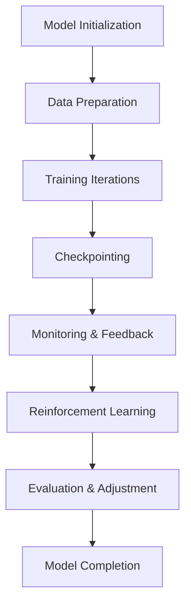

# Training Process and Workflow

## Overview

The training process is the core of refining models, ensuring they meet the desired specifications and performance metrics. This component outlines the training pipeline, focusing on training configurations, workflow management, and the integration of feedback loops to optimize model performance. The workflow is designed to be modular, allowing different components to be reused, extended, or swapped out as necessary, depending on the specific goals of the project.

The training process integrates seamlessly with the testing and evaluation components, where feedback from tests informs model adjustments during training. This iterative process ensures that the model continuously improves as it learns.

## Key Features

### 1. **Modular Training Components**
   - **Training Driver**: Responsible for initializing and managing the training process, including handling data loading, model training, and checkpointing.
   - **Data Pipeline**: Manages the preprocessing, augmentation, and feeding of training data into the model, ensuring that data is in the right format and split into training/validation sets.
   - **Optimizer**: The optimizer controls how the model adjusts its parameters to minimize the loss function. Various optimizers (e.g., Adam, SGD) can be used based on the task.
   - **Scheduler**: The scheduler adjusts hyperparameters like the learning rate during training to improve convergence and model stability.
   - **Checkpointing**: Regular checkpoints are created to save model states during training. This allows the training process to be paused and resumed if necessary.
   
### 2. **Feedback Loop Integration**
   - **Automated Feedback from Testing**: The model receives performance feedback from the testing and evaluation components. If the model's behavior deviates from the expected interaction protocol, feedback is provided to steer the model toward correct behavior.
   - **Reinforcement Learning**: Based on evaluation results, reinforcement learning techniques help guide training, enhancing the model’s ability to adhere to protocols or improve specific areas of performance.
   
### 3. **Training Control**
   - **Manual Intervention**: Users can intervene during training to adjust hyperparameters, change datasets, or alter the training configuration.
   - **Adaptive Training**: The system adapts based on the feedback received from evaluation, allowing it to shift focus to areas that require further refinement.
   - **Early Stopping**: If training metrics plateau or the model reaches satisfactory performance, training can be stopped early to save resources and time.
   
### 4. **Multi-GPU Support**
   - **Distributed Training**: While focused on single-node setups, the system can be expanded to support multi-GPU configurations for faster training. The system utilizes data parallelism to split the workload across multiple GPUs.
   - **Model Parallelism**: In multi-GPU environments, different parts of the model can be placed on different GPUs, allowing for more efficient memory usage and computation.
   
### 5. **Training Metrics and Monitoring**
   - **Training Curves**: Training curves show how the model's performance evolves over time, helping identify if training is progressing effectively or if adjustments are needed.
   - **Real-time Monitoring**: Training metrics, including loss and accuracy, are monitored in real time. Users can observe the progression and intervene if necessary.
   - **Model Performance Evaluation**: Periodic evaluations are conducted on the current model state to assess its performance and decide whether further training is required.

---

## Process Flow

1. **Model Initialization**: 
   - The training driver initializes the model and training configuration, including the optimizer, learning rate scheduler, and any other relevant settings.

2. **Data Preparation**: 
   - The data pipeline preprocesses and prepares the training data, ensuring it’s ready for the model. This may involve data augmentation, tokenization, and splitting into training/validation sets.

3. **Training Iterations**: 
   - The model undergoes a series of training iterations, where parameters are adjusted according to the optimizer's instructions.
   - During each iteration, the model receives feedback from the test cases (if available) and adapts to refine its performance.

4. **Checkpointing**: 
   - Regular checkpoints are created to save the model state. This allows resuming training from a certain point without losing progress.

5. **Monitoring and Feedback**: 
   - The system continuously monitors training performance using metrics such as accuracy, loss, and token efficiency. Feedback is provided to adjust the training process if the model deviates from the expected behavior.

6. **Reinforcement Learning**: 
   - As training progresses, reinforcement learning techniques help adjust the model to better adhere to the interaction protocol or to improve efficiency.

7. **Evaluation and Adjustment**: 
   - After a certain number of iterations or at key checkpoints, the model is evaluated to determine if further training is required or if adjustments should be made.

8. **Model Completion**: 
   - Once the model reaches satisfactory performance, training is completed, and the model is ready for deployment.
   - The model is either saved as a LoRa file or merged into a single model, depending on the use case.

---

## Training Workflow Example

## Key Considerations

1. Model Size and Resource Constraints
Larger models require more computation resources and memory. Optimizing training configurations to balance speed and memory usage is crucial.
2. Iteration Time vs. Resources
Depending on the hardware (single-GPU or multi-GPU), training iteration times may vary. A balance between iteration time and resource allocation needs to be established for efficient training.
3. Hyperparameter Tuning
Hyperparameter tuning (e.g., learning rate, batch size) is critical to achieving optimal performance. A systematic approach is needed to test various configurations and select the best-performing set.
4. Data Quality
The quality of the training data directly influences the model's learning and final performance. Ensuring data consistency, completeness, and relevance to the problem domain is key.

## Conclusion

The training process in this setup is flexible, modular, and feedback-driven. The integration of testing, evaluation, and reinforcement learning ensures that the model improves continuously based on user-defined goals. Feedback loops guide the training process, focusing on performance improvements such as protocol adherence, efficiency, and task-specific capabilities.

This modular system supports a wide variety of use cases, from simple fine-tuning of pre-trained models to full-scale custom training with multi-GPU setups, ensuring scalability and flexibility to meet the project’s evolving needs.