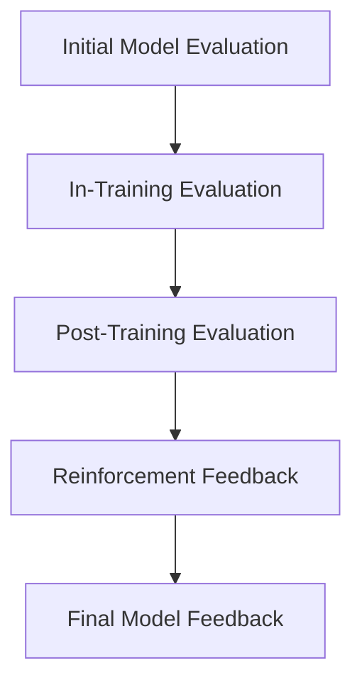

# Model Evaluation and Feedback Mechanisms

## Overview

Evaluating the model’s performance during and after training is essential for ensuring it meets the desired goals. It also helps to identify areas for improvement, especially for models that need to comply with specific protocols, such as the interaction protocol with Roo Code. This document outlines how evaluation and feedback mechanisms integrate with training processes to refine the model and make it adaptable for deployment or further fine-tuning.

In this context, evaluation is not just about measuring the model's task-specific accuracy but also about assessing its adherence to certain operational standards such as token efficiency, protocol compliance, and overall performance in real-world conditions.

## Key Features

### 1. **Performance Evaluation Metrics**
   - **Accuracy**: The model’s ability to correctly complete tasks and adhere to the defined behavior.
   - **Efficiency**: Key metrics like token consumption, inference time, and memory usage. These are especially important for consumer hardware or resource-constrained environments.
   - **Protocol Adherence**: How well the model follows predefined interaction protocols, such as using specific tools or methods in a specified order, performing refinements, etc.

### 2. **Evaluation at Different Stages**
   - **Pre-Training Evaluation**: Initial evaluation to assess baseline performance. This could include using a base model with no fine-tuning applied.
   - **In-Training Evaluation**: Periodic evaluation during training allows for adjustments to be made quickly and helps identify problems early on.
   - **Post-Training Evaluation**: After training has completed, a final evaluation ensures that the model is fully aligned with the desired protocols and task performance.

### 3. **Continuous Monitoring**
   - **Real-Time Feedback**: Continuous monitoring ensures that deviations from expected behavior are flagged as soon as they occur. The model can be adjusted in real-time during the training process, ensuring the training direction remains optimal.
   - **Behavioral Adjustments**: The feedback loop not only measures accuracy but can trigger real-time behavioral adjustments, such as revisiting the task definition or fine-tuning hyperparameters.

### 4. **Automated Feedback Loops**
   - **Model Evaluation System**: The evaluation system will automatically provide feedback to the training system after each iteration or batch of training. This feedback can be used to adjust the training process, tweak hyperparameters, or re-train specific components of the model.
   - **Metric-Based Adjustments**: Feedback from the evaluation will be focused on the relevant metrics (e.g., accuracy, token consumption), and adjustments will be made accordingly. The goal is to keep the model aligned with the training objectives while optimizing efficiency.

### 5. **Reinforcement Learning Integration**
   - **Feedback for Reinforcement**: In cases where reinforcement learning is employed, the model learns from the feedback based on the performance of previous iterations. This feedback can help fine-tune decision-making processes, ensuring that specific goals such as efficiency or protocol compliance are met.
   - **Positive and Negative Feedback**: The feedback can be used to reinforce correct behaviors and penalize those that deviate from the expected behavior. The model can then adjust to improve its responses over time.

---

## Evaluation and Feedback Workflow

1. **Initial Model Evaluation**:
   - The baseline model is evaluated using predefined metrics to establish a reference point. This helps to identify what the model is capable of before any fine-tuning occurs.

2. **In-Training Evaluation**:
   - Evaluation happens periodically throughout the training process. This includes running a suite of automated tests that check both task performance and protocol adherence.
   - Real-time feedback is provided to correct any issues early.

3. **Post-Training Evaluation**:
   - After training, a final evaluation is conducted to ensure the model adheres to the desired benchmarks for efficiency, protocol compliance, and overall task accuracy.

4. **Reinforcement Feedback**:
   - During training, reinforcement feedback is used to optimize the model’s ability to follow the specified protocols and perform tasks efficiently. This could involve adjusting training data, hyperparameters, or model configurations.

5. **Final Model Feedback**:
   - After the model reaches the final stage, it undergoes a comprehensive evaluation, ensuring that it fulfills the training objectives and meets the desired operational standards. This step ensures that the model is ready for deployment or further fine-tuning if necessary.

---

## Example Evaluation Workflow

## Considerations for Model Evaluation

### 1. **Accuracy vs. Efficiency**
   - In many cases, there is a trade-off between accuracy and efficiency (e.g., token consumption). It’s crucial to find a balance that allows the model to perform tasks well without consuming too many resources.

### 2. **Overfitting and Underfitting**
   - Evaluation metrics should help to identify overfitting (when the model performs well on training data but poorly on unseen data) and underfitting (when the model doesn't perform well on any data). Proper evaluation during training helps mitigate these issues.

### 3. **Protocol Adherence**
   - Ensuring that the model follows the interaction protocol is as important as its performance on the task. Evaluation should explicitly check that protocol rules are followed at all times, minimizing any deviations from the established behaviors.

### 4. **Feedback Impact**
   - Feedback should be specific and actionable. Vague or overly general feedback may not guide the model in the right direction, so it’s essential to target feedback that directly impacts the metrics being optimized.

---

## Conclusion

A robust evaluation system with continuous feedback ensures that the model is not only trained effectively but also adheres to the interaction protocols and operational standards defined for the task. By continuously monitoring and adjusting during training, and by applying reinforcement learning when needed, the model can be steered toward optimal performance with minimal human intervention. 

By integrating feedback mechanisms and testing frameworks throughout the training process, you ensure that your model meets expectations for efficiency, task performance, and protocol adherence.

---
