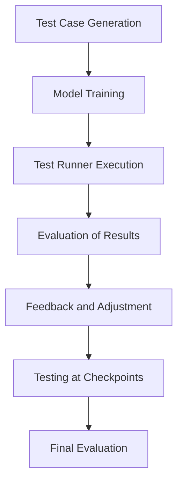

# Integration with Testing and Evaluation

## Overview

The integration between training, testing, and evaluation is crucial for building a robust model that adheres to the specified requirements. This component outlines how testing and evaluation are woven into the overall training process. It emphasizes the importance of continuous performance monitoring and feedback during training, ensuring the model can meet user-defined benchmarks and function properly in its intended environment.

Testing ensures that the model can handle real-world use cases, while evaluation provides the necessary metrics to quantify its performance. This integrated system enables the automated generation of test cases, continuous assessment, and real-time feedback loops that guide the training process toward a refined final model.

## Key Features

### 1. **Automated Test Case Generation**
   - **Test Generator**: The test generator creates a wide range of test cases based on specific interaction protocols, model behavior expectations, and use case scenarios. These tests can be used to evaluate how well the model adheres to protocols, reduces token consumption, and processes tasks efficiently.
   - **Training vs. Testing**: The test generator runs tests both during training and independently to evaluate the model’s adherence to established standards.
   
### 2. **Continuous Performance Monitoring**
   - **Real-Time Monitoring**: As the model trains, performance is continuously monitored against a set of predefined benchmarks. This monitoring includes metrics such as accuracy, loss, token efficiency, and protocol adherence.
   - **Early Feedback**: If the model begins to deviate from the expected behavior, feedback is provided immediately to correct its trajectory. This feedback can come from test cases or from reinforcement learning strategies.

### 3. **Testing Framework Integration**
   - **Test Runner**: The test runner is responsible for executing test cases during both training and after checkpoints are made. It can trigger tests automatically at defined intervals or upon specific events, such as the completion of a set number of iterations.
   - **Test Results Evaluation**: Test results are automatically evaluated using predefined criteria. This evaluation helps assess the model’s progress in achieving its goals, including adherence to interaction protocols and reduced token consumption.

### 4. **Evaluation Metrics and Feedback**
   - **Performance Evaluation**: After each training epoch or checkpoint, the model is evaluated against a set of metrics that gauge its effectiveness in fulfilling the task. Evaluation includes not only performance metrics like accuracy but also efficiency metrics such as token consumption, response time, and memory usage.
   - **Feedback Mechanism**: Based on the results of the evaluations, feedback is provided to the model or training system, adjusting the training process to steer the model back on track. This can include adjusting hyperparameters, fine-tuning the model, or introducing new test cases to address specific areas of concern.

### 5. **Testing for LoRa and Full Model**
   - **LoRa File Testing**: When working with LoRa files, tests are run specifically to evaluate how well the fine-tuned model performs compared to the base model. The goal is to ensure that the LoRa file improves on specific aspects like protocol adherence or task efficiency.
   - **Full Model Testing**: If a full model (not a LoRa) is being trained, it undergoes more extensive testing to verify that all aspects of the model, including new behaviors and capabilities, work as expected in a variety of scenarios.

---

## Testing and Evaluation Workflow

1. **Test Case Generation**: 
   - Automatically generate test cases based on the interaction protocol and task-specific requirements. The test generator can take input from the model’s desired behavior to create a comprehensive test suite.

2. **Model Training**: 
   - The model begins training, and performance is continuously monitored. During training, specific test cases may be run on the model to evaluate how it is progressing toward the desired behavior.

3. **Test Runner Execution**: 
   - At regular intervals or after key events (e.g., training iterations, checkpoints), the test runner executes the pre-generated test cases on the model. These tests evaluate whether the model’s behavior adheres to the expected outcomes.

4. **Evaluation of Results**: 
   - After each test, the results are evaluated using a set of predefined metrics. This step provides insights into how well the model is performing, both in terms of task accuracy and efficiency (e.g., token consumption, adherence to protocols).

5. **Feedback and Adjustment**: 
   - Based on the evaluation results, feedback is provided to the training process. This feedback can involve adjusting hyperparameters, changing the dataset, or fine-tuning the model to improve specific behaviors.

6. **Testing at Checkpoints**: 
   - When a model checkpoint is reached, a full evaluation is conducted. The test cases are rerun to ensure the model has maintained or improved its performance, and any issues are addressed immediately.

7. **Final Evaluation**: 
   - After the training process is complete, a final round of testing is conducted to assess the model’s overall performance, ensuring that it meets the requirements. If the model passes all tests, it’s ready for deployment or fine-tuning as needed.

---

## Example Workflow

## Considerations for Integration

### 1. **Real-Time Feedback and Iterative Training**
   - To maintain an efficient training process, feedback loops need to be fast and efficient. This requires a well-optimized test runner and performance evaluation system to minimize overhead.

### 2. **Test Coverage and Accuracy**
   - Comprehensive test coverage ensures that the model is tested on a variety of interaction scenarios, providing accurate and reliable feedback. The quality and diversity of test cases directly impact the reliability of the evaluation process.

### 3. **Reproducibility of Results**
   - All tests should be reproducible, allowing for consistent evaluations across different runs and environments. This ensures that results can be compared and used as benchmarks for model performance.

### 4. **Scalability of Testing Framework**
   - The testing framework should be designed to scale efficiently with the size of the model and the complexity of the tasks. It should be able to handle large models and datasets without causing bottlenecks during testing.

---

## Conclusion

The integration of testing and evaluation into the training pipeline ensures that the model not only learns effectively but also meets the desired standards for efficiency and task performance. By automating the generation of test cases, continuously monitoring the model’s performance, and providing real-time feedback, the system ensures that the model’s training is constantly guided toward optimal results.

This system improves the overall quality and reliability of the model, ensuring that it functions as expected in the real world, adheres to protocols, and consumes resources efficiently.

---

