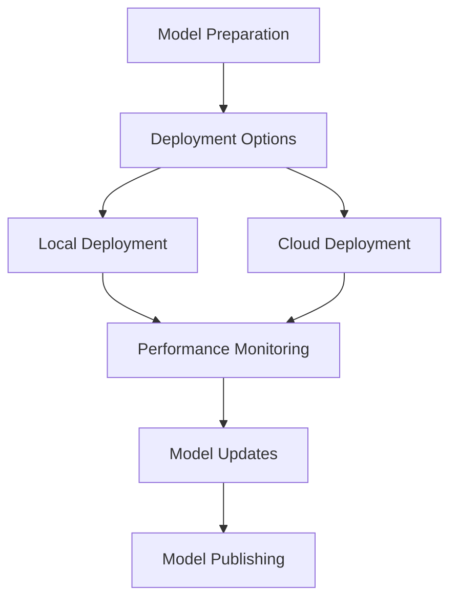

# Deployment, Monitoring, and Publishing

## Overview

Once the model is trained, evaluated, and fine-tuned, the next step is deployment. This section outlines the process of preparing the model for production use, monitoring its performance in real-world applications, and publishing the model for others to use. The goal is to make the deployment process seamless, efficient, and scalable.

## Key Features

### 1. **Model Deployment**
   - **Local Deployment**: Deploying the model on local infrastructure, such as a server, cloud machine, or edge device, depending on the requirements of the use case.
   - **Cloud Deployment**: For high availability and scalability, deploying the model in the cloud (e.g., AWS, Azure, GCP) allows it to handle large traffic loads and provide quick responses for users.
   - **Containerization**: Using Docker or similar containerization tools to package the model and its dependencies into an isolated environment, ensuring portability and consistent behavior across different systems.

### 2. **Model Versioning**
   - **Model Versions**: As models are iterated upon, versioning allows tracking changes over time. Each version should be tagged and stored appropriately to ensure reproducibility and rollbacks if necessary.
   - **Model Compatibility**: Ensure backward compatibility with previous versions, especially when integrating new versions into larger systems or products.

### 3. **Monitoring the Model in Production**
   - **Performance Monitoring**: Continuously monitor the model’s performance (e.g., latency, accuracy, error rates) to ensure it is operating as expected in production. If the model’s performance starts degrading, immediate action can be taken.
   - **Data Drift Detection**: Over time, the data the model sees may evolve, leading to changes in its performance. Monitoring for data drift helps to identify when retraining or updates to the model are necessary.
   - **Logging**: Collect detailed logs of the model’s interactions with real-world data and users. These logs can be valuable for debugging and improving the model's performance after deployment.

### 4. **Model Updates and Retraining**
   - **Incremental Updates**: Once a model is deployed, it should be monitored regularly. If performance drops due to new types of data or use cases, incremental updates (or full retraining) can be applied to improve the model.
   - **Continuous Training Pipelines**: Set up automatic retraining pipelines that can retrain the model with new data, potentially with minimal human intervention, ensuring that the model stays up to date.
   - **Rolling Updates**: When updating the model, use rolling updates to ensure that users always have access to a working model while the new model is being deployed.

### 5. **Publishing the Model**
   - **Model Hosting Platforms**: If the model is to be shared with others or integrated into an API service, it can be published to hosting platforms like Ollama, Hugging Face, or custom hosting solutions.
   - **Documentation**: Provide clear and detailed documentation on how the model works, its API endpoints, and usage instructions. This ensures that other developers and users can integrate the model seamlessly into their workflows.
   - **Model Metrics Dashboard**: A dashboard displaying key metrics of the model’s performance in production can help users track its effectiveness over time.

---

## Deployment Workflow

1. **Model Preparation**:
   - Package the trained model, its dependencies, and configuration files for deployment. This can be done through Docker or virtual environments.
   - Version the model to track different iterations and ensure compatibility with downstream applications.

2. **Deployment Options**:
   - Choose between local and cloud deployment based on resource requirements and traffic expectations.
   - For cloud deployment, use cloud-native services (e.g., AWS EC2, Azure VM) or managed AI platforms (e.g., AWS SageMaker, Azure ML).

3. **Model Monitoring**:
   - Implement performance monitoring and logging systems to detect anomalies or degradation in performance.
   - Regularly check for data drift and ensure that retraining pipelines are in place.

4. **Model Updates**:
   - If performance issues are detected, deploy incremental updates or fully retrain the model with new data.
   - Use rolling updates to ensure no downtime during model updates.

5. **Publishing the Model**:
   - Upload the trained model to a public or private model hosting platform.
   - Ensure that the model is well-documented and supported by appropriate monitoring and feedback mechanisms.

---

## Example Deployment Diagram

## Considerations for Model Deployment

### 1. **Scalability**
   - When deploying models, especially in cloud environments, scalability is key. Cloud services like AWS, GCP, and Azure provide auto-scaling features that ensure your model can handle varying loads without manual intervention.

### 2. **Security**
   - Ensure that the model and its deployment infrastructure are secure. This includes securing APIs, encrypting sensitive data, and adhering to best practices for cloud security.
   
### 3. **Cost Optimization**
   - For cloud deployments, ensure that the cost is optimized. This includes choosing the right instance types, optimizing for inference costs, and considering spot instances or other cost-saving strategies.
   
### 4. **User Access and Usage**
   - Make sure that the deployment provides the necessary access levels for users. If the model is part of an API service, ensure that API keys or other authentication mechanisms are in place.
   
### 5. **Model Maintenance**
   - Models need to be maintained after deployment. This includes ensuring they continue to perform well as data evolves, monitoring for drift, and implementing automated retraining if necessary.

---

## Conclusion

Deploying and monitoring models is a critical step in making the results of your training process available for real-world use. By following best practices for deployment, monitoring, and updating, you ensure that the model continues to perform well and remains aligned with your training goals over time. The ability to update the model efficiently, coupled with continuous monitoring, will help you maintain a robust, production-ready solution that can evolve as your requirements change.

---
