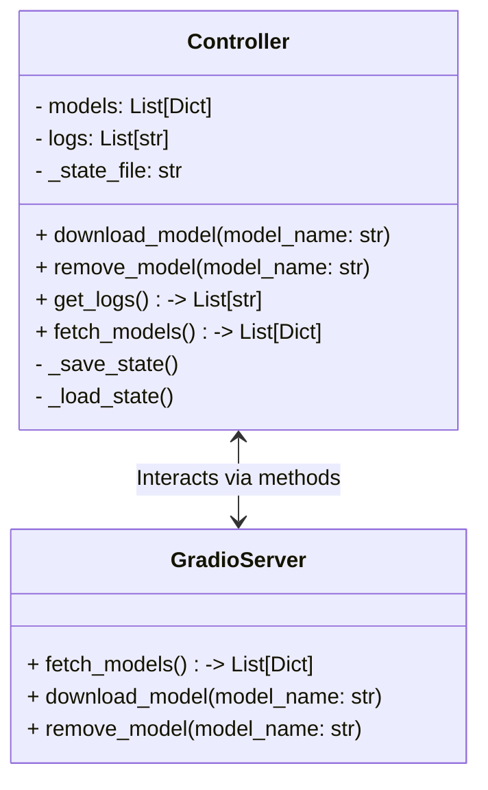

# Integration Plan for Persistent and In-Memory State in Controller

## Objective
Integrate the in-memory state with persistent storage in the controller, ensuring that the Gradio UI reflects the same data for all users. State persistence should occur only on significant user events, such as downloading or removing a model.

---

## Plan

### 1. Update the Controller Architecture
- **Objective**: Synchronize the in-memory state (`models` and `logs`) with the persistent state (`controller_state.json`) only on significant user events.
- **Steps**:
  1. Modify the `_load_state` method to initialize the in-memory state (`models` and `logs`) from the persistent state (`controller_state.json`) when the controller is instantiated.
  2. Ensure that `_save_state` is only called after significant user events (e.g., `download_model`, `remove_model`).
  3. Refactor the `download_model` and `remove_model` methods to:
     - Update the in-memory state.
     - Persist the updated state to `controller_state.json`.

---

### 2. Ensure Gradio UI Reflects the Persistent State
- **Objective**: Ensure that the Gradio UI always displays the latest state of the models, even when a new user opens the interface.
- **Steps**:
  1. Modify the `fetch_models` function in `src/gradio_server.py` to retrieve the models from the controller's in-memory state.
  2. Ensure that the Refresh button in the Gradio UI triggers a re-fetch of the models from the controller.

---

### 3. Dependencies Between Gradio Server and Controller
- **Objective**: Minimize tight coupling between the Gradio server and the controller to ensure maintainability.
- **Steps**:
  1. Use the controller as the single source of truth for the models and logs.
  2. Ensure that the Gradio server interacts with the controller only through well-defined methods (e.g., `fetch_models`, `download_model`, `remove_model`).

---

## Updated Architecture Diagram

---

## Implementation Steps

### 1. Refactor the Controller
- Modify `_load_state` to initialize the in-memory state from the persistent state.
- Ensure `_save_state` is only called after significant user events.
- Refactor `download_model` and `remove_model` to update both the in-memory and persistent states.

### 2. Update the Gradio Server
- Modify `fetch_models` to retrieve the models from the controller's in-memory state.
- Ensure the Refresh button triggers a re-fetch of the models.

### 3. Test the Integration
- Verify that the models are correctly persisted to `controller_state.json` after significant user events.
- Ensure that the Gradio UI displays the latest state of the models for all users.

---

## Next Steps
Proceed with implementing the plan in Code mode.